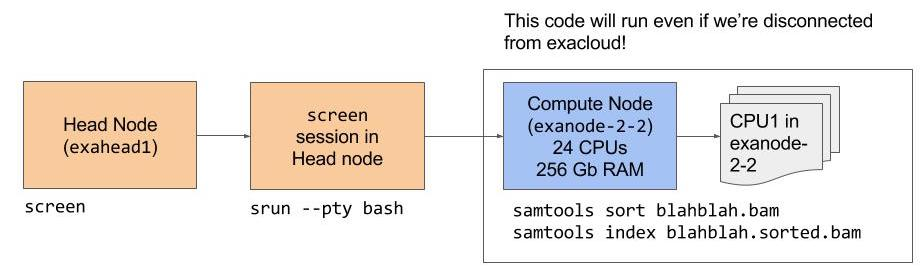

# Workshop Expectations

We want to foster a positive learning environment in this workshop. We expect everyone to adhere to the [Code of Conduct](http://github.com/laderast/exacloud_tutorial/CODE_OF_CONDUCT.md). We will enforce this and ask you to leave if you are not respectful to others.  
In short:


  + be respectful of each other's learning styles 
  + don't be dismissive or mean to someone who knows less than you
  + try to help people if you see them struggle and you can help. 

Additionally, please work together! The people in my workshops who have a really bad time and don't get anything out of it are the ones who try to do it alone. To quote Legend of Zelda, "*It's dangerous to go alone*". Talking through the material with someone will help you understand it.

We also are giving people post-it notes. Put them on your laptops so we can identify you if you need help or not. *Green* means "I'm okay, don't bug me", *Red* means "I need some help!".

# Prerequisites for this training:

You will need the following:

1) ACC Login
2) Permission to join exacloud
3) SSH terminal program (such as Terminal (Mac/Linux) or PuTTY(Windows))
4) Optional: an FTP program (WinSCP/Cyberduck) for transferring files

You should be able to understand the following:

1) What a shell script is
    + How to run a shell script
    + What a shebang is and setting up your shell script
2) Basic shell commands, including:
    + directory and file manipulation: `ls`, `rm`, `mkdir`, `rmdir`
    + file editing using `nano`, `vim`, or `emacs`.
    + how to set basic file permissions
    + what process monitoring is: `ps` and `kill`
3) How to run your program/workflow on the command line
    + R: `Rscript`
    + Python: `python`
    + Executable: `GATK`
4) Know how to find if your executable is already on exacloud
    + `which` and `where`
    + some possible locations
    + `/opt/installed/` -- various package-specific bin/ and sbin/ subdirectories
    + `/opt/rh` -- see the scl(1) man page and/or https://accdoc.ohsu.edu/main/howto/scl-intro/
    + `/usr/local` -- not just the `bin/` and `sbin/` subdirs but also, e.g., /usr/local/cuda/bin
    + Your lab's space in Lustre or on RDS

If you are unsure what any of these are or need a refresher, here is a DataCamp course: [Intro to Shell For Data Science]( https://www.datacamp.com/courses/introduction-to-shell-for-data-science). I recommend reviewing Chapters 1, 2, and 4.

## What is Exacloud?

[Exacloud](http://www.ohsu.edu/xd/research/research-cores/advanced-computing-center/exacloud.cfm) is OHSU's cluster computing environment. It's available for those people who have an ACC account and who request access. It exists to do many kinds of compute jobs:

+ Running genomic aligners, such as Genome Analysis Toolkit (GATK)
+ Running complicated analysis jobs in R
+ General python data processing (numpy, pandas, text analysis)
+ image analysis pipelines

The initial hardware was donated by Intel, but it also funded by the OHSU Knight Cancer Institute, Howard Hughes Medical Institute (HHMI), and the OHSU Center for Spatial Systems Biomedicine (OCSSB). `exacloud` is maintained by the Advanced Computing Center (ACC).

To run jobs effectively on `exacloud`, you must understand some basic shell scripting techniques and how exacloud is organized. That's the goal of this training workshop.

## Architecture of `exacloud`


Exacloud is organized by what are called *nodes*. Each node can be thought of as a multi-core or multi-CPU unit with usually 24 cores that share memory together. There are 250 nodes, which means that exacloud has has over 6000 CPUs of varying capabilities and memory that can be utilized by users who want to run parallel computing jobs. 

There are two different types of nodes on exacloud: the first type is the *head node*, which is the node that you sign into initially into exacloud (this is usually `exahead1.ohsu.edu`). The head node handles all of the scheduling and file transfer to the other nodes in the system. 

The other nodes are known as subservient *compute nodes*. They don't do anything unless the head node assigns them a task. Note that different nodes may have different configurations; they may have graphical processing units (GPUs) for computation, they may have less memory, or they might have special software installed on them (such as Docker). 

How does the head node tell the compute nodes what to do? There is a program called Slurm (Simple Linux Utility for Resource Management) installed on the *head node* that schedules computing jobs for all of the *compute nodes* on exacloud. How does it decide which jobs to run on which nodes? Part of it has to do with compute requirements - each individual job requires a certain amount of CPU power and Memory. You will request this when you run the job. Your request for allocation is balanced with the current load (i.e. other jobs currently running) on the cluster.

A note: `slurm` is different than the previous job scheduler on `exacloud`: HTCondor. Slurm does less than HTCondor: it really only lets you request allocations with particular memory/CPU requirements. It doesn't try to do more than that, unlike HTCondor, which provided a simple way to batch process files. This means that the majority of your scripts for running jobs will use `bash` scripting to get things done. 

## Useful reference material

Here's a [list of *terminology* and a list of *useful slurm commands*](reference/). If you get confused by any terms, please refer to it.

## How do I access `exacloud`?

Most of the time, you will sign in to `exahead1`. You will need a terminal program (Mac/Linux has terminal built in, Windows will need to [download something like PuTTY]()). There are two head nodes on exacloud:

  + `exahead1.ohsu.edu` (SSH in) - only accessible within OHSU Firewall
  + `exahead2.ohsu.edu` (SSH in) - only accessible within OHSU Firewall

File transfering via SFTP (using something like WinSCP (PC) or Cyberduck (Mac)) can be done at both `exahead1.ohsu.edu` and `exahead2.ohsu.edu`.
  
All of you should have external access to `exacloud`, which means you should be able to access it from off-campus. How to access it from off-campus? You will need to go through the ACC gateway first, and then ssh into `exahead1` or `exahead2`. 

+ `acc.ohsu.edu` : SSH gateway
+ `acc.ohsu.edu`: SFTP gateway (limited to 10 GB, and whatever is linked from RDS)

## Filesystems 1: Your ACC directory

For reference: [The full list of file systems and storage available on exacloud](https://accdoc.ohsu.edu/exacloud/guide/storage/).

When you sign into `exahead1`, you will sign in to your ACC home directory. This directory is the directory that is accessible to all machines managed within ACC (for example, state.ohsu.edu, the DMICE server). I usually use my ACC directory for things like file libraries, my scripts, and such. Today we'll also use it for our data.

Note there's a limit on file storage for your acc directory (10 GB), so if you need more room for your data, you will need to put it on lustre or the other options.

## Filesystems 2: Lustre

Lustre is the shared file system on exacloud. It is a distributed file system, that means that all nodes can easily access it. It is meant to be a *temporary* home for data and files that need to be processed by exacloud.

We will not be using lustre for our workshop today. If you want to put files on lustre, you will need to request access for a particular lab and group. If you are not attached to a group, you will not have access to lustre.

If you don't need to process your data immediately, please don't leave it on lustre, as it's a shared resource. If you need to store your data for a longer period of time, please request [Research Data Storage](http://www.ohsu.edu/xd/research/research-cores/advanced-computing-center/research-data-storage.cfm) to store it.

## Filesystems 3: Research Data Storage

What if you're accumulating data, but don't need to analyse it right away? Then you should put it in [Research Data Storage](http://www.ohsu.edu/xd/research/research-cores/advanced-computing-center/research-data-storage.cfm) (RDS). Yearly costs are per terabyte of data. It's pretty reasonable, and the costs are on the ACC website.

RDS can also be used as a data backup for large datasets. Contact [email:acc@ohsu.edu](Advanced Computing Center) for more information.

# Workshop 

Now that we've got all that out of the way, we can actually start to do stuff on exacloud!

Note: these instructions assume you're within the OHSU firewall. If you're off campus, you'll need an ACC external access account and will have to `ssh USERNAME@acc.ohsu.edu` before you do these steps. `acc.ohsu.edu` is the "gateway" to all machines hosted by ACC. 

## Task 0 - Sign in to exacloud and clone this repo

1. To connect with exacloud, use the ssh command and input your password when prompted.

```
ssh USERNAME@exahead1.ohsu.edu
```

2. Now that you're signed in, clone the repository using `git`:

```
git clone https://github.com/laderast/exacloud_tutorial
```

3. You should now have a directory in your home directory called `exacloud_tutorial`. Change into the repository directory and you should be ready to go!

```
cd exacloud_tutorial
```

## Task 1 - Let's look at the overall structure of exacloud


Before we even do something on exacloud, we're going to look at how exacloud is organized.

1. Try running the following command. What partitions exist on exacloud?

```
scontrol show partition
```
That's a lot of information! Let's just focus on the partition names. There are five main partitions of compute nodes that you should have access to: `exacloud`, `highio`, `light`, `long_jobs`, and `very_long_jobs`. 

If you want to see the other partitions (including those you don't currently have access to), you can use the `-a` flag. Currently, there are a couple of partitions not accessible to everyone: `gpu`, and `mpi`. If you need to use these, you can request access via ACC.

```
scontrol show partition -a
```
The default partition (if you don't request one) is `exacloud`, which is where most of the general purpose nodes are. If your job needs to run a long time (longer than a week), you will need to specify using the `very_long_jobs` queue.

2. Let's look at information for one node. Take a look at the information you get. In particular, look at `CPUTot` (the total number of CPUs), `RealMemory` (amount of memory available to node in Mbs), and `Partitions`.

```
scontrol show node exanode-0-0
```

If you want to see all of the information for all of the nodes (again, use spacebar to page, and q to quit):

```
scontrol show node | less
```

3. Let's look at everyone who's running a job on exacloud. Try running this command. You can page through with the spacebar, and when you're done, you can use `q` to get out of `less`.

```
squeue | less
```

4. If you want to look at the jobs that a particular user is running, you can use the `-u` flag. Try `squeue -u` on one of the users in the queue, for example `wooma`:

```
squeue -u wooma
```
You will usually use `squeue -u` on your own username, so you can see the status of your jobs.

Let's take a look at the output. You can see some pretty useful info: the `JOBID`, what `PARTITION` the job is running under, and the `ST`atus. 

`ST`atus is really important, because it can tell you whether your job is:

`R` (Running), `PD` (Pending), `ST` (Stopped), `S` (Suspended), `CD` (Completed). 

There may be many reasons why your job is `PD` and isn't running. You might have asked for way more memory or CPUs that are available. The queue may be exceptionally full and you have been running a lot of jobs. `slurm` is [fair in how it allocates resources](https://accdoc.ohsu.edu/exacloud/guide/job-scheduler/), so that no one user can dominate the queue. Keep this in mind when you set up a job. Asking for 1 or 2 nodes (~24 to 48 CPUs) is pretty reasonable, but asking for 100 nodes might be asking for trouble. When in doubt, contact ACC.

```
            JOBID PARTITION     NAME     USER ST       TIME  NODES NODELIST(REASON)
           3970834 very_long KIRC.bla    wooma  R 11-04:21:09      1 exanode-7-15
           3970835 very_long OV.blast    wooma  R 11-04:20:32      1 exanode-7-5
           3970833 very_long GBM.blas    wooma  R 11-04:21:44      1 exanode-7-8
           4034201 very_long PAAD.bla    wooma  R 1-23:03:50      1 exanode-7-4
           4011215 very_long bacteria    wooma  R 4-04:23:28      1 exanode-7-10
           4002777 very_long viral_se    wooma  R 5-02:06:14      1 exanode-7-14
           3971962 very_long CESC.bla    wooma  R 11-02:10:12      1 exanode-0-26
           3970837 very_long BRCA.bla    wooma  R 11-04:19:07      1 exanode-2-3
           4011061 long_jobs SKCM_TCG    wooma  R 4-04:23:29      1 exanode-7-10
           4034206 long_jobs SKCM_TCG    wooma  R 1-23:01:51      1 exanode-2-20
           4044154 long_jobs process_    wooma  R    4:37:45      1 exanode-2-25
           4043015 long_jobs SKCM_TCG    wooma  R    7:14:20      1 exanode-2-44
```

5. `sinfo` is another way to get more information about exacloud. It provides quite a bit of info about the current status of nodes in each partition, such as whether they are being used, or are down. If you'd like the big picture view, try it:

```
sinfo
```

### What you learned in this section

+ The overall structure of exacloud, with its different partitions using `scontrol show partition`
+ How to request information about a node using `scontrol show node`.
+ How to get information about jobs (including your own) using `squeue`
+ Getting way too much information about all the nodes with `sinfo`

## Task 2 - Let's use **srun**


Ok! Now we know the basic architecture of exacloud, let's use the foundational command of `srun`. Basically, `srun` will let you run a simple command on one of the compute nodes. We're going to run a python script with `srun`. We're not going to ask for anything special in terms of allocation; we'll take what `slurm` gives us.

If you only need to do a quick one off job, `srun` is your friend. If you need to do a job many times, you should consider using `sbatch` to automate it. 

We're going to run `samtools` on a small bam file. `samtools` is already installed on exacloud and is located here: 

`/opt/installed/samtools-1.6/bin/samtools`

There are other locations for software (this information [comes from here](https://accdoc.ohsu.edu/static/exacloud-slurm.pdf)) which are:

+ `/usr/bin`, `/usr/sbin` - most linux utilities are here
+ `/opt/rh` - newer versions of some packages - `python 3.5` and `git 2.9` are here. 
+ `/opt/installed` - where we're using `samtools` from

1. `cd` into the `samtools_example` folder. We're going to run `samtools sort` on the first `bam` (`SRR1576820_0001.bam`) file in this folder, and sort the reads. These are really small regions of this `bam` file.

```
cd samtools_example
```
2. Let's make a symbolic link to `/opt/installed/samtools-1.6/bin/samtools/` called `samtools_opt` so we don't have to type this over and over again. When we want to run `samtools`, we can just type in `./samtools_opt`. This is basically a temporary measure. If you want to just have access to `samtools`, you should add `/opt/installed/` to your PATH environment variable.

```
ln -s /opt/installed/samtools-1.6/bin/samtools samtools_opt
```

3. Let's use `srun` to run `samtools`. Notice the command is identical to just running `samtools sort` but we just put an `srun` in front of it. Take a note of the job id that srun returns.

```
srun ./samtools_opt sort SRR1576820_0001.bam -o SRR1576820_0001.sorted.bam
```
3. Where did the `SRR1576820_0001.sorted.bam` appear? (hint: use `ls` to list the contents of your present working directory.) Let's index the sorted file. 

```
srun ./samtools_opt index SRR1576820_0001.sorted.bam
```

4. Let's look at statistics. We pipe (`|`) `samtools stats` into `grep` so we can just see the summary statistics.

```
srun ./samtools_opt stats SRR1576820_0001.sorted.bam | grep ^SN | cut -f 2- 
```

5. Confirm that you have sorted the file using `samtools view` piped into `head`:

```
srun ./samtools_opt view SRR1576820_0001.sorted.bam | head
```

### What you learned in this section

+ Where to look for software on exacloud
+ running `samtools` using `srun`
+ Using `srun` for simple jobs.

## Task 3 - Let's do an interactive job



Ok, let's look at an alternative way to do this. We may have to actually test an entire pipeline on exacloud and make sure it works, and that our script is finding the software in the entire pipeline. We can do this in using an *interactive session*. 

Before we run our interactive job, we're going to open a `screen` session. `screen` is a handy unix utility that lets you continue to run jobs even after you are disconnected from `exacloud`. I sometimes use it to keep an interactive session open so I can go back to it.

Since running `screen` and requesting an `interactive` session can feel very Inception-y and confusing, I'm going to give you a way to tell what node you're on, whether it's the head node, or your compute node with the `hostname` command.

1. Type `screen`. You should get a blank screen. That didn't seem very useful. Type `hostname`. Your hostname should be `exahead1`. 

2. Let's request an interactive session. The way we do this is by using `srun`, with a few options (see below). What about `bash`? We're opening a `bash` shell on our requested node, which means we can run any commands there.

```
srun --pty --time=0:10:00 -c 1 --mem 10240 bash
```

+ `--pty` (gives us a prompt)
+ `--time` (we're asking for 20 minutes of time on the reserved node)
+ `-c` (request number of CPUs, notice it's a `-` and not a `--`)
+ `--mem` (request memory in megabytes, we're asking for 1 Gig of memory)

3. Let's confirm that we're on a different node. Type `hostname` and make sure that you're not on `exahead1`.

4. Ok, let's do sorting and alignment, but for `SRR1576820_0002.bam`. Since we're in interactive mode, we don't need `srun`. Basically we are on the compute node and can just run things as if it were our own machine.

```
./samtools_opt sort SRR1576820_0002.bam -o SRR1576820_0002.sorted.bam
./samtools_opt index SRR1576820_0001.sorted.bam
./samtools_opt stats SRR1576820_0001.sorted.bam | grep ^SN | cut -f 2-
```

4. Let's get out of our `screen` session for a second. Type `CTRL-a` and then the `d` key. Type `hostname` to confirm that you're in `exahead1`. Whoa, it's like a portal between worlds.

5. Run `squeue -u USERNAME` with your user name to see your job. Note the job number.

6. Use `screen -x` to get back into your screen session. Since we're done with our processing, we can use `exit` to get out of our interactive session. Confirm that you're in `exahead1` using `hostname`. Let's also get out of our screen session by using `exit` again. You should see a `[screen is terminating]` message.

7. Let's see how our job ran. Run `sacct`:

```
sacct --format=JobID,Partition,jobname,ncpus,alloccpus,elapsed,NTasks,MaxVMSize
```

This is what my output looked like:

```
       JobID  Partition    JobName      NCPUS  AllocCPUS    Elapsed   NTasks  MaxVMSize 
------------ ---------- ---------- ---------- ---------- ---------- -------- ---------- 
4058912        exacloud   samtools          1          1   00:00:03        1          0 
4058914        exacloud   samtools          1          1   00:00:01        1          0 
4058916        exacloud   samtools          1          1   00:00:01        1          0 
4058918        exacloud   samtools          1          1   00:00:01        1          0 
4060240        exacloud       bash          1          1   00:08:31        1    125696K 
4060260        exacloud       bash          1          1   00:08:51        1            

```

You can see the profile information for everything we did in the interactive session. Pay attention to `NCPUS` (the number of CPUS actually used), `Elapsed` (the time it took to run the job), and `MaxVMSize` (how much memory your job actually took). When you request a batch job (below), you will use these numbers to request resources.

### Important Note - how to not get other `exacloud` users mad at you

*Please, please, please*, **don't run any jobs other than transferring files** on the head node of `exahead1`. Running something like an R job or a python job on it will slow down the head node, and make things run badly for everyone, since `exahead1` will be doing your job instead doing what it's there for, which is allocating resources for other jobs. In the worst case scenario, you will bring down `exahead1` and other users will be very, very, very upset with you.

How to avoid this? If you're running an interactive job, make sure you're not on the head node when you run it. Here's a quick way to check if you're on the head node. If you're on the head node, running `hostname` will return 

```
exahead1
``` 

If you're in an interactive session, `hostname` will return a different name, such as

```
exanode-2-44.local
```

### What you learned in this section

+ What an interactive session is
+ The basics of using `screen` and why to use it
+ Requesting an interactive session using `srun --pty bash`
+ How to run code in an interactive session
+ How to profile your jobs using `sacct`
+ How to know whether you're in the head node or a compute node using `hostname`.
+ Not running jobs on the head node

## Task 4 - Let's try a batch job


Okay, we've done a simple `srun` job and an interactive job. What if we want to do multiple jobs at once? That's where `sbatch` comes in.

We're going to request 1 node with 3 CPUs to run our batch job. We've got 6 files that are numbered from `SRR1576820_0001.bam` to `SRR1576820_0006.bam`, so we can loop over them somehow. 

Here's the contents of `runBatch.sh`. As you can see, it's basically a `bash` shell script with a few extra lines that are passed on to `sbatch`, that specify our requirements for the allocation. Here we're asking for 1 node for 5 minutes, with 3 tasks per node * 1 cpu per task = 3 CPUs total, with 1 Gb memory for each. 

```
#!/bin/bash
#SBATCH --nodes=1 #request 1 node
#SBATCH --array=1-6
#SBATCH --tasks-per-node=3 ##we want our node to do 3 tasks at the same time
#SBATCH --cpus-per-task=1 ##ask for 1 CPUs per task (3 * 1 = 3 total requested CPUs)
#SBATCH --mem-per-cpu=1gb ## request 1 gigabyte per cpu
#SBATCH --time=00:05:00 ## ask for 5 minutes on the node
#SBATCH --
srun ./samtools_opt sort SRR1576820_000$SLURM_ARRAY_TASK_ID.bam -o SRR1576820_000$SLURM_ARRAY_TASK_ID.sorted.bam 
```

The lines beginning with `#SBATCH` are called *directives*, and they are basically requests to `sbatch` to find nodes with particular requirements.

The last line is where the magic happens. Using the `array` argument, we set it to range from 1 to 6, since we have six files. `sbatch` will loop over the array from 1 to 6, and use `srun` to assign it our tasks to our 3 CPU allocation. Everytime it invokes `srun`, it places the `array` value in `$SLURM_ARRAY_TASK_ID`. 

Since our files range from `SRR1576820_0001.bam` to `SRR1576820_0006.bam`, we can just insert `$SLURM_ARRAY_TASK_ID` as an input to `samtools sort` and also use it to specify its output. 

This may seem like it's really convoluted, but there is a good reason to run multiple jobs as a job array. It makes cancelling a bunch of tasks much easier, because they are all run under the same job.

1. Okay, let's try running `runBatch.sh`:

```
sbatch runBatch.sh
```

2. After it's done, try running `sacct` to see how much memory and time each task took.

```
sacct --format=JobID,Partition,jobname,ncpus,alloccpus,elapsed,NTasks,MaxVMSize
```

Here's part of my output:

```
       JobID  Partition    JobName      NCPUS  AllocCPUS    Elapsed   NTasks  MaxVMSize 
------------ ---------- ---------- ---------- ---------- ---------- -------- ---------- 
4067593_1      exacloud runBatch.+          3          3   00:00:09                     
4067593_1.b+                 batch          3          3   00:00:09        1          0 
4067593_1.0               samtools          3          3   00:00:09        3    953348K 
4067593_2      exacloud runBatch.+          3          3   00:00:11                     
4067593_2.b+                 batch          3          3   00:00:11        1          0 
4067593_2.0               samtools          3          3   00:00:11        3    953348K 
```

You can see each entry in the `JobID` column has a normal job number `4067593`, with an extra number attached, such as `4067593_1`. This extra number is the `task` id. The nice thing about this is that all of our tasks have the same job id, which means that if we made a mistake, we could just `scancel` the job id and all of these tasks would end. Handy!

3. Try altering `runBatch.sh` to have `tasks-per-node=6` instead and run it again. Do `sacct` again. How has the run time of each task changed?

4. Here's another way to process a bunch of files with the same file extension. Here we run `samtools index` on our `.bam.sorted` files. Take a look at `runSorted.sh`:

```
#!/bin/bash
#SBATCH --nodes=1 #request 1 node
#SBATCH --tasks-per-node=3 ##we want our node to do 2 tasks concurrently
#SBATCH --cpus-per-task=1 ##ask for  CPUS (3 * 1)
#SBATCH --mem-per-cpu=1gb ## request 1 gigabyte per cpu
#SBATCH --time=00:05:00 ## ask for 5 minutes on the node
#SBATCH

## Try running this script with sbatch --array=0-5 runSorted.sh

## This statement is where the magic happens - we list all file names
## that have sorted.bam in them with ls, then pipe the output to awk to return
## the filename whose line number is the task id one by one to the srun
## statement below

## note that we have to know how many files are in our directory
## and we pass it in as an --array argument to sbatch

arrayfile=`ls *.sorted.bam | awk -v line=$SLURM_ARRAY_TASK_ID '{if (NR == line) print $0}'` 
## now run samtools index on the file
srun /opt/installed/samtools-1.6/bin/samtools index $arrayfile
```

Look at the statement that starts with `arrayfile`. We'll go over this slowly so everyone understands it. Notice we haven't specified an `--array` argument. We can pass that in to `sbatch` when we run it. 

5. Try running `runSorted.sh` on the sorted files:

```
sbatch --array=0-5 runSorted.sh
```

Why do we specify `--array=0-5` here, instead of `--array=1-6`? 

### Oh nos! I maed a mistaek

Inevitably, you will submit a batch job and realise that you forgot to add something to the shell script, or that it's running way too long. No need to worry! That's what `scancel` is for. 

You usually use `scancel` on the job id. If you have a bunch of *tasks* assigned to one job id, then they will all be cancelled. Again, this is why you want to use job arrays.

```
scancel JOBID
```

### A note about the different partitions on exacloud

We've mentioned the default partition, `exacloud`. It has a time limit of 36 hours. For longer jobs, there are the following partitions:

+ long_jobs — jobs running up to 10 days (max num of jobs)
+ very_long_jobs — jobs running up to 30 days (suspendable)

These are accessible to everyone, but the number of nodes on each is limited. If you can, try using the default `exacloud` partition.

### For more info

We've only scratched the surface of job arrays. More info is here: 

+ https://www.accre.vanderbilt.edu/wp-content/uploads/2016/04/UsingArrayJobs.pdf
+ https://rcc.uchicago.edu/docs/running-jobs/array/index.html
+ https://www.rc.fas.harvard.edu/resources/documentation/submitting-large-numbers-of-jobs-to-odyssey/

Also, your scripts can build in dependencies into how it processes files. This way, you can run multiple steps for each set of files. For more information: 

+ https://hpc.nih.gov/docs/job_dependencies.html

### How does slurm allocate resources to nodes?

The unsatisfactory short answer is: it's complicated. It depends on how many *nodes*, *tasks-per-node*, and *CPUs per task* you request. 

Remember the node architecture usually has 24 cores (or CPUs) apiece. The number of CPUs you request per node is defined by:

```
number CPUs = number of tasks/node * number of cpus/task
```

So if you request 1 *node*, 24 *tasks-per-node*, and 1 *CPU per task*, you will use the full node (24 *tasks-per-node* times 1 *CPU per task* = 24 CPUs). If you request less than 24 CPUs, you may be sharing a node. Your job may run a little slower as a result. Just keep this in mind. 

https://slurm.schedmd.com/cpu_management.html

### What you learned in this section

+ What `sbatch` does
+ How to request resources using `#SBATCH` in a script
+ How to use job arrays in your script
+ A more sophisticated way to use job arrays
+ A little bit about job dependencies
+ More about the partitions
+ A little bit about how you should request resources

# Congratulations!

If you've gotten this far, pat yourself on the back! You're well on your way to using exacloud responsibly. The links and documentation above and below should help you go further.

If you're intimidated, you can always ask for more help. ACC has their own [documentation on exacloud](https://accdoc.ohsu.edu/exacloud/), which is where most of this information comes from. You can ask questions in the biodata-club slack at http://biodata-club.slack.com If we don't know, we'll ask ACC.

Remember: be a good exacloud citizen, since it's a shared resource. [Take the pledge](pledge/).

# We have to go deeper

Here are some resources about the most frequently asked questions about exacloud.

## How do I install software that isn't on exacloud?

Most of the software you need for alignment and such is already in exacloud. If you need to install other research software, you can use a package manager such linuxbrew or miniconda, which Ben Cordier has helpfully posted instructions on installing:  https://github.com/greenstick/bootstrapping-package-management-on-exacloud

## Environment Variables are your friend

One of the big problems with running jobs on exacloud is that the compute nodes don't know about the location of software, or your library. There are some solutions to this.

If you've installed software in your home directory or in your lustre groups folder, you'll have to either update your `PATH` variable so that `bash` can see it, or there are special variables such as `R_LIBS_USER` that you need to set.

Python users can use virtual environments for customizing their own python installations on exacloud. 

I will update this section with links when I find good ones.

## Slurm specific questions

https://slurm.schedmd.com/faq.html


